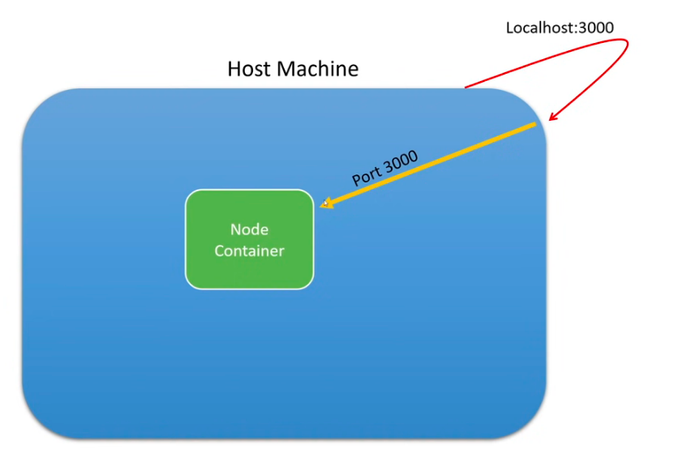

## Follow Restful Design using [Microsoft Docs](https://docs.microsoft.com/en-us/azure/architecture/best-practices/api-design) as your guide

<hr />

### Methods:
 - `GET`: A `successful` GET method typically returns HTTP status code `200 (OK)`. 
    - If the `resource cannot be found`, the method should return `404 (Not Found)`.
    - If the `request was fulfilled but there is no response body included` in the HTTP response, then it should return HTTP status code `204 (No Content)`.

## Docker 
<hr />

### How to build an image
```bash
docker build -t image-name .
```

- Add the `-t` flag if we want to add an image name
- The `.` at the end of the command means `use current directory` 

### How to check list of existing images

```bash
docker image ls
```

### Check list of current containers

```bash
docker ps
```

### Build a new container

```bash
docker run docker_image_name
```

#### Flags
- Name Container `--name` followed by the `docker_container_name`
- Port Forwarding `-p`: Allow the docker container to talk to the outside world.
   - ``` -p external_port:internal_port ```
   - Example: 
   ```bash
   docker run -p 3000:3000 --name docker_container_name docker_image_name
   ``` 
   - In this shows how the host machine makes an external call to the container the requests gets passed to the node server inside the container

   


### Delete Image
```bash
docker image rm container_id -f 
```
- The `-f` flag is force the delete.

### Delete Container
```bash
docker 
```

### Checkout the files located within the docker container

```bash
docker exec -it docker_container_name bash
```

#### Flags:
- Interactive `-i`

# Start the Server

- Option 1: Locally

- Option 2: Local Docker Container